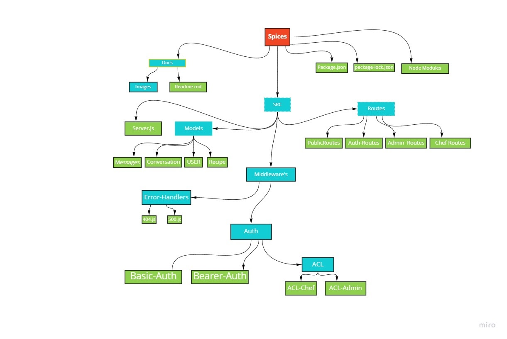
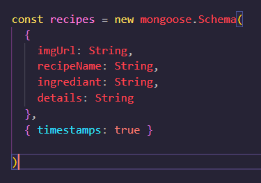
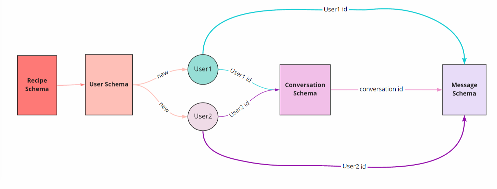

# spices-backend

## group members 
   * Baha'a Qasim. 
   * Bara'ah Alomari. 
   * Batool Ayyad. 
   * Rula Qasem. 
   * Sokiyna Jaber 


## Heroku Link:

[spices backend](https://spice-g4.herokuapp.com/)

## Problem domain

If you love to cook and thinking of starting your own food selling business or you are a food lover, then your suitable place is our website, because spices allows you to publish your own recipes and dishes and allows food lovers to request these recipes. We are making a new start where you can create your own restaurant from home.

## UML



## Database Diagram

**recipes schema:**



**User schema:**

.png>)

**conversation schema:**

.png>)

**message schema:**

.png>)

## Database flow Diagram



## Authentication and Authorization

- **shign up**

  - metode: `Post`
  - route: `/signup `
  - authentication: none
  - req.pody:
    ```json
    {
      "email": "test@test.com",
      "username": "test",
      "password": "test",
      "role": "test"
    }
    ```
  - you will recive email.

- **Email verification**

  - metode: `Put`
  - check your email.
  - route: `/api/verify/verificationToken`
  - authentication: none

- **shign in**

  - metode: `Post`
  - route: `/signin `
  - ## authentication: Basic authe:
    ```
    "username": "test"
    "password": "test"
    ```
  - req.pody:
    ```json
    { "email": "test@test.com" }
    ```

- **Forgot password**

  - metode: `post`
  - route: `/api/forget`
  - you will recive email.
  - authentication: none
    - req.pody:
    ```json
    { "email": "test@test.com" }
    ```

- **change password**
  - metode: `put`
  - check your email.
  - route: `/api/forget/:token`
  - req.pody:
    ```json
    {
      "password": "test"
    }
    ```
  - authentication: none

## role:

- **Admin**

  - Block Users:

    - metode: `delete`
    - route: `/deleteUser/:username`
    - authentication: bearer tocken

  - Delete Content:
    - metode: `delete`
    - route: ` /deleteContent/:userid/:ricepId`
    - authentication: bearer tocken

- **chef**

  - Post recipes:
    - metode: `Post`
    - route: `/addfood`
    - authentication: bearer tocken
    - req.pody:
    ```json
    {
      "description": "test",
      "date": "test"
    }
    ```
  - Delete recipes:
    - metode: `Delete`
    - route: `/deletefood/:foodId`
    - authentication: bearer tocken
  - Edit recipes:
    - metode: `Put`
    - route: `/updatefood/:foodId`
    - authentication: bearer tocken
    - req.pody:
      ```json
      {
        "description": "test",
        "date": "test"
      }
      ```
  - Display all recipes:
    - metode: `Get`
    - route: `/getfood`
    - authentication: bearer tocken

- **User**

  - Display all recipes:
    - metode: `Get`
    - route: `/getallfood`
    - authentication: none
  - Add to favorite recipes:

    - metode: `Post`
    - route: `/addtofav`
    - authentication: bearer tocken

    - req.pody:

    ```json
    {
      "userId": "test",
      "postId": "test"
    }
    ```

  - Search for chef:
    - metode: `Get`
    - route: `/getallfood/:id `
    - authentication: none

## Online chat:

- Start private conversation
  - metode: `Post`
  - route: `/conversations `
  - req.pody:
    ```json
    {
      "senderId": "test",
      "receiverId": "test"
    }
    ```
- get all conversation
  - metode: `get`
  - route: `/conversations/userId `
- get one conversation between two
  - metode: `get`
  - route: `/find/:firstUserId/:secondUserId`
- Send messages:
  - metode: `Post`
  - route: `/messages`
  - req.pody:
    ```json
    {
      "conversationId": "test",
      "sender": "test",
      " text": "test"
    }
    ```
- Receive messages:
  - metode: `get`
  - route: ` /messages/:conversationId`
